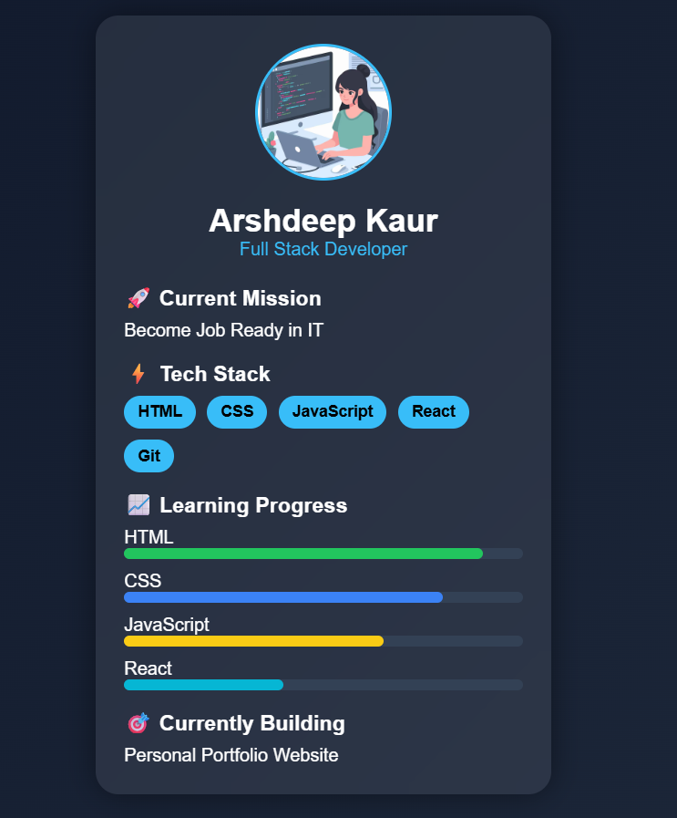

# 🚀 Developer Identity Card

A modern Developer Identity Card built with HTML and CSS featuring a glassmorphism design, skill badges, progress bars, and interactive hover effects.

## ✨ Features

- Modern UI Design
- Glassmorphism Effect
- Developer Profile Section
- Tech Stack Badges
- Learning Progress Bars
- Hover Animation
- Responsive-Friendly Layout

## 🛠️ Built With

- HTML5
- CSS3

## 📸 Preview

## 🎥 Demo Video
[Watch Demo](Assests/videos/demoday1.mp4)

## 🎯 Purpose

This project was created to practice HTML structure, CSS styling, Flexbox layouts, and modern UI design principles.

## 📂 Project Structure
Day 1- Personal-Profile-Card/
│
├── index.html
├── style.css
├── README.md
│
├── assets/
│   │
│   ├── profile/
│   │   └── profile.jpg
│   │
│   ├── images/
│   │   └── day1preview.png
│   │
│   └── videos/
│       └── day1demo.mp4
## 👩‍💻 Author

Arshdeep Kaur

Aspiring Full Stack Developer

Learning • Building • Growing Every Day 🚀